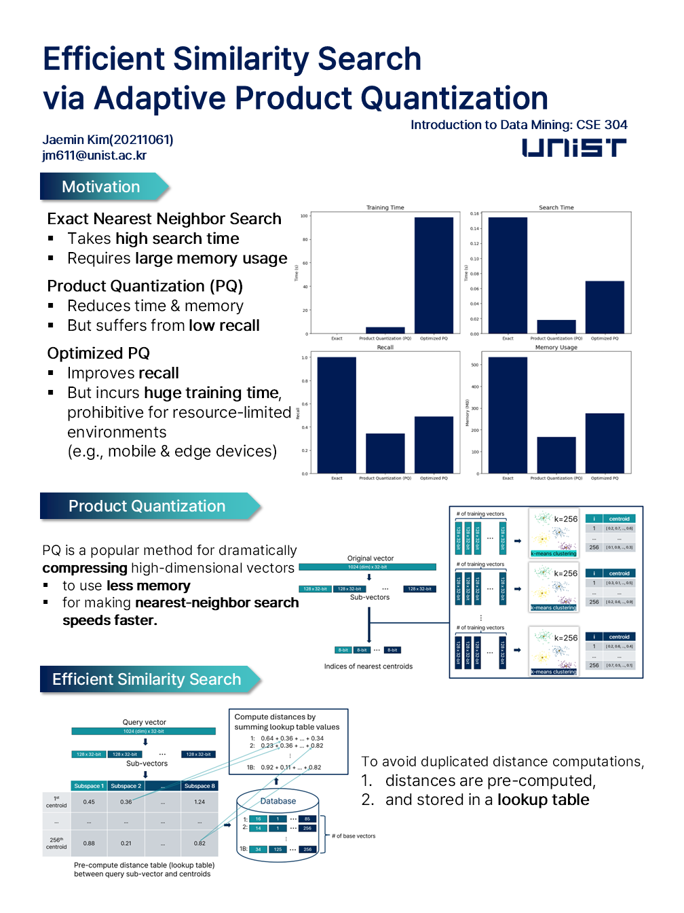
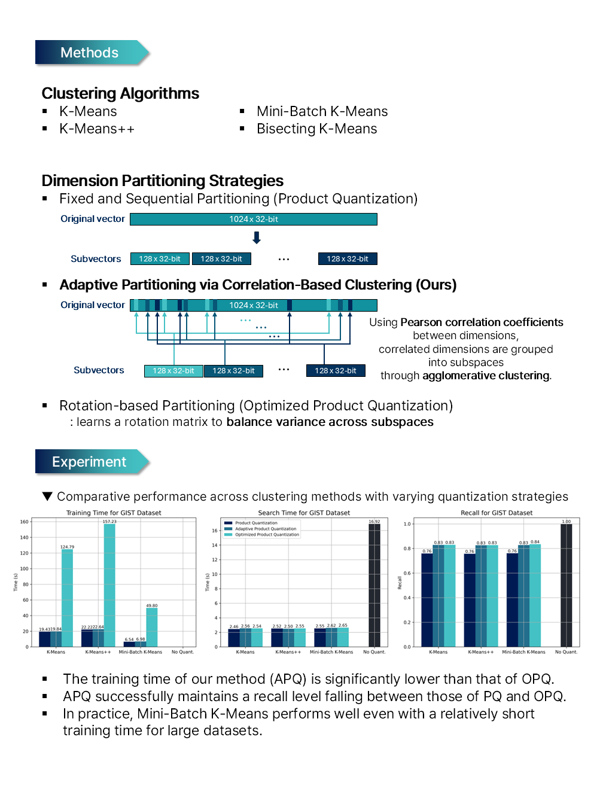

# 📌 CSE304 Term Project
20211061 Jaemin Kim
<br>
<br>

# 🔍 Efficient Similarity Search via Adaptive Product Quantization

## 🚀 Quick Start
```bash
conda create --name ess_env
conda activate ess_env
conda install -c pytorch -c nvidia faiss-gpu=1.7.0 pytorch=*=*cuda* pytorch-cuda=11 numpy psutil scikit-learn
python eval.py <dataset_name>
```
<br>

## 📄 Paper
[View pdf](https://unistackr0-my.sharepoint.com/:b:/g/personal/jm611_unist_ac_kr/EVvHbGS7CQhBsCpsq4MK7ewBaBIAA30Aoy_EHC2a_byV7Q?e=R7fjeM)

<br>

## 🖼️ Poster




<!-- ## Clustering Methods
### 1. K-Means
### 2. K-Means++
### 3. Mini-Batch K-Means
### 4. Bisecting K-Means
<br>

## Partitioning Methods
### 1. Fixed and Sequential Partitioning (Product Quantization)
### 2. Adaptive Partitioning via Correlation-Based Clustering
### 3. Rotation-based Partitioning (Optimized Product Quantization) -->
<br>

## 📊 Experiments
### Datasets
<!-- datasets used: [DOWNLOAD](https://unistackr0-my.sharepoint.com/:u:/g/personal/jm611_unist_ac_kr/ES1UA4V2i45Fmqu-_1BkFW0BhkaE7JAkA9Cha2G5w3G1Ag?e=EKfurg) -->

- Deep: 96-dimensional image (subset of [Deep1B](https://github.com/arbabenko/GNOIMI/blob/master/downloadDeep1B.py))
    - learn: 100,000
    - base: 1,000,000
    - query: 100

- Fashion-MNIST: 784-dimensional image (scikit-learn)
    - learn: 5,000
    - base: 50,000
    - query: 100

- GIST: 960-dimensional image (subset of [ANN_GIST1M](http://corpus-texmex.irisa.fr/))
    - learn: 10,000
    - base: 100,000
    - query: 100

- GloVe: 300-dimensional text (subset of [glove.6B.300d](https://nlp.stanford.edu/projects/glove/))
    - learn: 10,000
    - base: 100,000
    - query: 100

<!-- - SIFT: 128-dimensional ([ANN_SIFT1M](http://corpus-texmex.irisa.fr/))
    - learn: 100,000
    - base: 1,000,000
    - query: 100 -->